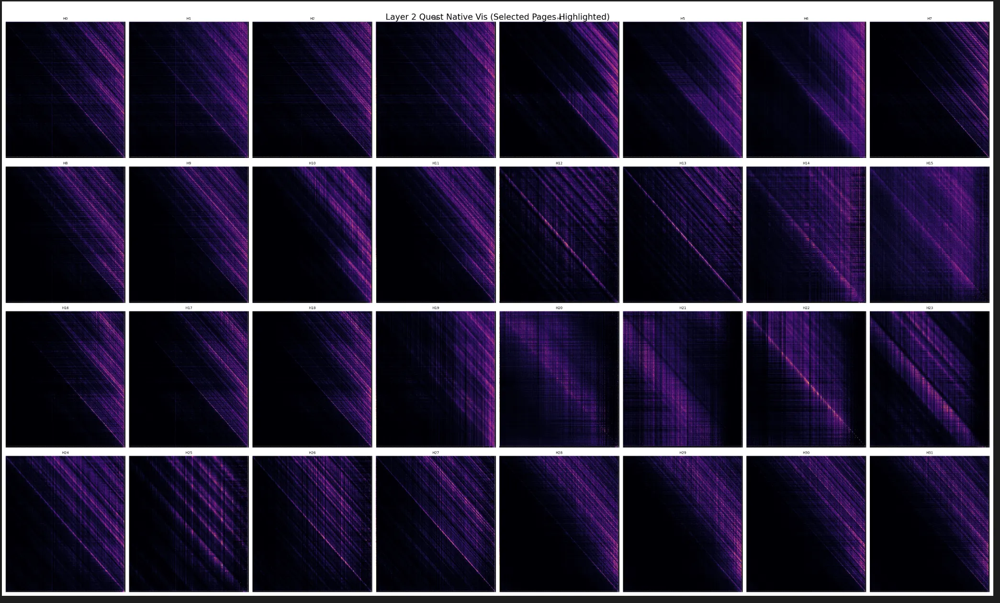

# 大模型的复读机现象的解决

我今天在复现 Quest 的选择方式的时候，发现 Quest 的输出信息如下：

```bash
(quest) root@node023:/users/cyx/Quest/aux_exp# python3 visualize_quest_shadow.py 
Loading model: /users/cyx/Meta-Llama-3-8B-Instruct
Loading checkpoint shards: 100%|███████████████████████████████████████████████████████████████████████████████████████| 4/4 [00:07<00:00,  1.89s/it]
Enabling Quest Attention...
Injecting Visualization Wrapper...
Running Inference...
Prefill (3000 tokens)...
LlamaModel is using LlamaSdpaAttention, but `torch.nn.functional.scaled_dot_product_attention` does not support `output_attentions=True`. Falling back to the manual attention implementation, but specifying the manual implementation will be required from Transformers version v5.0.0 onwards. This warning can be removed using the argument `attn_implementation="eager"` when loading the model.
Starting from v4.46, the `logits` model output will have the same type as the model (except at train time, where it will always be FP32)
Start Decoding...
We detected that you are passing `past_key_values` as a tuple of tuples. This is deprecated and will be removed in v4.47. Please convert your cache or use an appropriate `Cache` class (https://huggingface.co/docs/transformers/kv_cache#legacy-cache-format)
Step 0: 220
Step 1: 358
Step 2: 220
Step 3: 358
Step 4: 220
Step 5: 358
Step 6: 220
Step 7: 358
Step 8: 220
Step 9: 358
Step 10: 220
Step 11: 358
Step 12: 220
Step 13: 358
Step 13: 358
Step 14: 220
Step 15: 358
Step 16: 220
Step 16: 220
Step 17: 358
Step 18: 220
Step 19: 358
Step 20: 220
Step 21: 358
Step 22: 220
Step 23: 358
Step 24: 220
Step 25: 358
Step 26: 220
Step 27: 358
Step 28: 220
Step 29: 358
Text:   I  I  I  I  I  I  I  I  I  I  I  I  I  I  I
```

重复输出空格和 I，很明显模型没有正常推理，一定是代码有问题。问一下 AI，得到了一些笼统的答案，比如说位置编码出现问题了（这里出问题会有什么现象，还不太清楚，可以埋个坑研究一下），比如说 Quest 压缩太狠了（这里被我果断驳斥了，之前复现 AdaKV 的时候 3000 token 按照 128 的预算压缩都能正常输出）。没办法，AI 还是不能代替人类，于是我得认真去分析问题所在了。

于是我先确认了注意力的计算，这里是 Quest 原生实现，没问题，逐行浏览代码后发现了这部分：

```python
    print("Start Decoding...")
    for step in range(GENERATE_LEN):
        with torch.no_grad():
            outputs = model(curr_input_ids, past_key_values=past_key_values, use_cache=True)
        past_key_values = outputs.past_key_values
        next_id = torch.argmax(outputs.logits[:, -1, :], dim=-1).unsqueeze(-1)
        curr_input_ids = next_id
        generated_ids.append(next_id.item())
        print(f"Step {step}: {next_id.item()}")
```

令人震惊的是，Cursor 直接手动实现了 decode（不知道它怎么想的），然后我直接质问它为什么不用 Transformer 的原生实现，这个时候它又行了，直接分析了这么写的问题：

> **Cache 管理缺失 (Major Risk)：**
> `model.generate()` 内部会处理 `DynamicCache` 或者 Tuple 形式的 KV Cache 的更新、裁剪和格式转换。
> 这里的代码极其天真：`past_key_values = outputs.past_key_values`。它假设 Model 返回的 Cache 格式是完全正确的，且可以直接透传给下一次调用。但对于 HuggingFace 最近的 Llama 版本，KV Cache 的处理变得很复杂（DynamicCache vs Legacy Tuple），很容易因为格式不匹配导致 Cache 失效，从而引发重复生成。
>
> **Attention Mask 缺失 (Major Risk)：**
> 代码里完全没有传递 `attention_mask`！
> 在 `model(curr_input_ids, past_key_values=..., use_cache=True)` 这一步，虽然理论上模型可以自动推断 Mask（因为是单步 Decode），但如果没有正确更新 Mask（特别是位置编码 Position IDs），模型可能会认为自己在重新处理第 0 个 Token，或者不知道前面的 Cache 有多长。
> 后果：位置编码错乱 -> 注意力机制失效 -> 重复生成 "I I I"。
>
> **采样策略缺失：**
> 这里用的是最简单的 `torch.argmax` (Greedy Decoding)。
> 没有 `repetition_penalty`（重复惩罚）。
> 没有 `temperature` / `top_p` 采样。
> 这会加剧模型陷入局部最优（重复循环）的倾向。

然后给出了解决方案：

```python
# 替换掉那个 for 循环

print("Start Decoding with model.generate()...")
input_len = input_ids.shape[-1]

# 设置生成参数
gen_config = {
    "max_new_tokens": GENERATE_LEN,
    "do_sample": False,         # 依然用 Greedy，方便对比
    "use_cache": True,
    "output_attentions": True,  # 必须开启，为了让 Wrapper 能够捕获到
    "return_dict_in_generate": True,
    "pad_token_id": tokenizer.eos_token_id
}

with torch.no_grad():
    output = model.generate(input_ids, **gen_config)

generated_seq = output.sequences[0]
new_tokens = generated_seq[input_len:]
print(f"Text: {tokenizer.decode(new_tokens)}")
```

我们不能轻信 AI，于是我开始自己查资料，看它说的原因是否正确，顺便学习一下这些部分的知识：

### Attention Mask

我们这里以 `transformers\src\transformers\models\llama` 文件夹为例：

在 `LlamaModel` 类的 `forward` 方法中，首先会调用 `_update_causal_mask` 来处理 mask。

```python
# ... existing code ...
    def forward(
        self,
        input_ids: torch.LongTensor = None,
        attention_mask: Optional[torch.Tensor] = None,
# ... existing code ...
        causal_mask = self._update_causal_mask(
            attention_mask, inputs_embeds, cache_position, past_key_values, output_attentions
        )
# ... existing code ...
```

进入 `_update_causal_mask` 方法（约第 1039 行），我们可以看到它如何通过 `_prepare_4d_causal_attention_mask_with_cache_position` 创建一个 **4D Mask**：

```python
# modeling_llama.py

# ... existing code ...

def _update_causal_mask(

# ... existing code ...
# In case the provided `attention` mask is 2D, we generate a causal mask here (4D).
causal_mask = _prepare_4d_causal_attention_mask_with_cache_position(
    attention_mask,
    sequence_length=sequence_length,
    target_length=target_length,
    dtype=dtype,
    device=device,
    min_dtype=min_dtype,
    cache_position=cache_position,
    batch_size=input_tensor.shape[0],
)

# ... existing code ...
```

这个函数（虽然定义在文件外部，但逻辑很清晰）会生成一个结合了 **Padding Mask** 和 **Causal Mask** 的 4D 张量，形状通常是 `(batch_size, 1, query_length, key_value_length)`。

- **Padding 部分**：对应 Padding Token 的位置被填入极小的负数（如 `-inf` 或 `min_dtype`）。这部分主要是针对 batch 中的短句子，我们将多个句子打包成一个 Batch 输入 GPU 训练或推理时，这些句子的长度通常是不一样的。矩阵运算（Tensor 操作）要求所有维度的长度对齐，因此我们必须把短句子 **补齐** 到和最长句子一样的长度。

```python
句子 A (长度 3): ["I", "love", "AI"]
句子 B (长度 5): ["The", "weather", "is", "nice", "today"]
补齐后 (Batch)：
句子 A 变成: ["I", "love", "AI", <PAD>, <PAD>]
句子 B 保持: ["The", "weather", "is", "nice", "today"]
```

- **Causal 部分**：这是一个上三角矩阵（Upper Triangular Matrix），对角线右上方的元素也是极小的负数，表示“未来不可见”。

总的来说：

**Attention Mask 就是要构建一个由 0 和 极小负数 组成的矩阵，将其加到 Attention Scores 上。**

- **0**：表示允许 Attention 关注该位置。
- **极小负数**：经过 Softmax 后变为 0，表示完全屏蔽该位置（无论是为了 Padding 还是为了因果性）。

这里我们可以用我生成的注意力的热力图来验证这个现象：



可以看到这图并不是常见的下三角，说明根本没有 Attention Mask 的参与。另外，如果说，有一张图是只有一根对角线，那么说明模型可能默认用相对位置 0 或 1 去查 Cache，这很有可能是位置编码没有被正确应用导致的。（这里也 mark 一下）

### Cache 管理

在 Llama 模型中，Cache（KV Cache）是从早期的简单的 Tuple 列表（Legacy format）演变成了更结构化的 **Cache 对象** 管理模式（主要涉及 `DynamicCache` 和 `StaticCache`）。DynamicCache 是动态增长的缓存，而 StaticCache 是预分配显存的静态缓存。

#### 1. Cache 对象的传递（在 Model 层）

在 `LlamaModel` 的 `forward` 函数中，模型接收 `past_key_values`。现在推荐使用 `Cache` 类的实例，而不是旧版的 Tuple。

```python
# ... existing code ...
    def forward(
        self,
        # ...
        past_key_values: Optional[Union[Cache, List[torch.FloatTensor]]] = None,
        # ...
    ):
# ... existing code ...
        # 兼容性处理：如果是旧版的 Tuple 格式，将其转换为 DynamicCache 对象
        if (
            use_cache and not isinstance(past_key_values, Cache) and not self.training
        ):  # kept for BC (non `Cache` `past_key_values` inputs)
            return_legacy_cache = True
            past_key_values = DynamicCache.from_legacy_cache(past_key_values)
# ... existing code ...
```

#### 2. Cache 的核心更新（在 Attention 层）

Attention 模块计算出当前的 Key (`key_states`) 和 Value (`value_states`) 后，调用 `past_key_value.update()` 方法将它们存入缓存，并获取包含历史信息的完整 KV。

```python
# ... existing code ...
        # 1. 计算当前的 Key 和 Value (此时仅包含当前 step 的 token)
        query_states = self.q_proj(hidden_states)
        key_states = self.k_proj(hidden_states)
        value_states = self.v_proj(hidden_states)

        # ... (Reshape 和 Transpose 操作) ...

        # 2. 调用 Cache 对象的 update 方法
        if past_key_value is not None:
            # sin, cos, cache_position 是辅助参数，用于处理 RoPE 和 StaticCache 的索引
            cache_kwargs = {"sin": sin, "cos": cos, "cache_position": cache_position}

            # 【核心代码】将当前的 k/v 写入缓存，并返回拼接了历史信息的完整 k/v
            key_states, value_states = past_key_value.update(key_states, value_states, self.layer_idx, cache_kwargs)
# ... existing code ...
```

- `LlamaAttention` **不关心** 缓存怎么存（是 `torch.cat` 拼接还是填入预分配的 Tensor）。它只负责调用 `.update()`。
- `.update()` 会返回 **包含了历史 Token** 的 `key_states` 和 `value_states`，供后续计算 Attention Score 使用。

#### 3. Cache Position 的控制（定位）

为了正确管理 Cache（特别是静态 Cache 或 Graph 模式），Llama 使用了 `cache_position` 变量。

在 `LlamaModel.forward` 中：

```python
# ... existing code ...
        if cache_position is None:
            # 获取当前 Cache 已经存了多长的数据
            past_seen_tokens = past_key_values.get_seq_length() if past_key_values is not None else 0
            # 计算当前输入的 token 应该放在哪个位置
            cache_position = torch.arange(
                past_seen_tokens, past_seen_tokens + inputs_embeds.shape[1], device=inputs_embeds.device
            )
# ... existing code ...
```

**作用**：告诉 `past_key_value.update()` 方法，新的 Key/Value 应该写在缓存的第几个位置。

#### 4. 生成循环中的输入处理（Prepare Inputs）

在文本生成（`model.generate`）的循环中，`prepare_inputs_for_generation` 方法负责利用 Cache 来“切片”输入。

```python
# ... existing code ...
    def prepare_inputs_for_generation(
        self, input_ids, past_key_values=None, ...
    ):
        # ...
        if past_key_values is not None:
            # 如果有 Cache，说明前面的 token 都算过了。
            # 我们只需要取输入的最后一个 token（或者根据 cache_position 切片）传给模型
            if inputs_embeds is not None:
                input_ids = input_ids[:, -cache_position.shape[0] :]
            elif input_ids.shape[1] != cache_position.shape[0]:
                input_ids = input_ids[:, cache_position]

        # ...
```

**原理**：

- **首字生成**：输入是完整的 Prompt，Cache 为空。
- **后续生成**：输入包含 `[Prompt + Generated_Tokens]`，但 `past_key_values` 里已经存了 `[Prompt + Old_Generated]` 的 KV。
- **切片**：代码通过切片操作，只把 **最新生成的那一个 Token** 喂给模型，避免重复计算历史 Token 的 Attention。

#### 总结 Cache 管理流程

1.  **用户**：在 `generate` 循环中维护一个 `Cache` 对象（通常是 `DynamicCache`）。
2.  **Model 入口**：计算 `cache_position`（当前是第几个词）。
3.  **Attention 层**：
    - 计算当前词的 \(K_{cur}, V_{cur}\)。
    - 调用 `cache.update(K_{cur}, V_{cur}, ...)`。
    - `Cache` 对象内部将新数据追加到历史数据中，返回完整的 \(K_{full}, V_{full}\)。
    - Attention 计算利用 \(K_{full}, V_{full}\) 关注整个序列。
4.  **下一次迭代**：`prepare_inputs_for_generation` 确保只传入下一个新词，重复上述过程。

### 采样策略

先看一下官方默认推荐的采样配置。

在 `convert_llama_weights_to_hf.py` 中，你可以看到转换脚本会为 Instruct 版本生成一个默认的 `GenerationConfig`：

```python
# ... existing code ...
    if instruct:
        generation_config = GenerationConfig(
            do_sample=True,      # 开启采样
            temperature=0.6,     # 温度采样
            top_p=0.9,           # 核采样 (Nucleus Sampling)
            bos_token_id=bos_token_id,
            eos_token_id=eos_token_id,
        )
# ... existing code ...
```

如果 **`do_sample=True`**，那么模型就会选择这种随机采样的策略。如果选择了这种策略，每次生成的结果都会不一样，然后 Temperature、Top-K、Top-P 决定怎么随机抽。

如果 `do_sample=False`，那么模型就会按照确定的模式抽样，也就是下面这些抽样方法：

- **Greedy Search (贪婪搜索)**：
    - 默认模式 (`do_sample=False`)。
    - 每次只选概率最高的词。
- **Beam Search (束搜索)**：
    - 通过设置 `num_beams > 1` 开启。
    - 同时维护多条路径，选出全局最优解。
- **Top-K Sampling**：
    - 设置 `top_k=50` (例如)。
    - 只从概率最高的前 K 个词中采样。
- **Contrastive Search (对比搜索)**：
    - 通过设置 `penalty_alpha` 和 `top_k` 开启。
    - 这是为了解决重复性问题而引入的较新策略。


<script src="https://giscus.app/client.js"
        data-repo="Caspian443/Caspian443.github.io"
        data-repo-id="R_kgDONWcQzA"
        data-category="Announcements"
        data-category-id="DIC_kwDONWcQzM4Cw29k"
        data-mapping="pathname"
        data-strict="0"
        data-reactions-enabled="1"
        data-emit-metadata="0"
        data-input-position="bottom"
        data-theme="light"
        data-lang="zh-CN"
        crossorigin="anonymous"
        async>
</script>

本站所有文章转发 **CSDN** 将按侵权追究法律责任，其它情况随意。